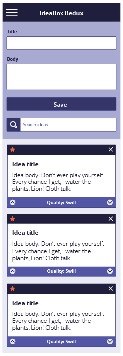
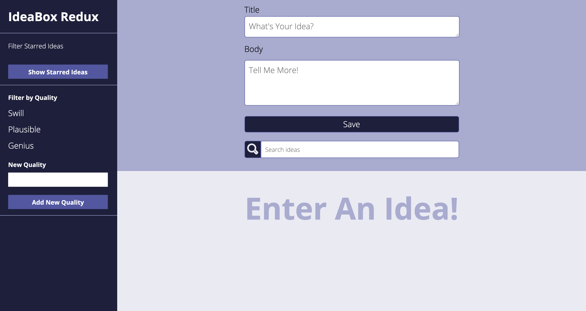
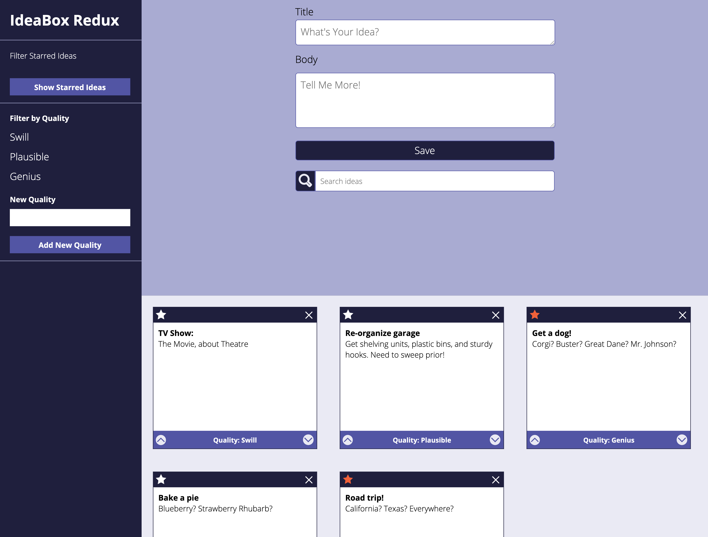
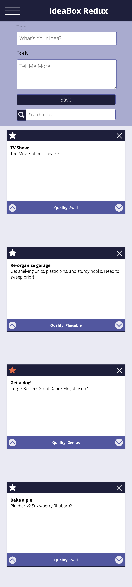

# Idea Box Project

## General Info

A project for deeping our understanding of JavaScript in Turing's Front-End Engineering course, Module 1.
Repository can be found <a href="https://github.com/SamuelColeman/idea-box">here</a>

## Collaborators 

#### By [Kate Malone](https://github.com/katemalone), [Vanessa Randall](https://github.com/vrandall66) & [Sam Coleman](https://github.com/SamuelColeman) 

## Motivation

Idea Box is a group project I was assigned as a mod one student at Turing. We were given a page comp with certiain requirements to reproduce from scratch in code. This was completed by primarily working with JavaScript functionality and using HTML and CSS for the foundation and styling on the page.

## Built With

- HTML5
- CSS3
- JavaScript
- Blood, sweat, and tears

## Screenshots

## Features

- [x] Displaying multiple boxes with multiple ideas
- [x] Ability to delete any idea from the page by pressing the 'x' on the box
- [x] Persisting ideas on page reload
- [x] Search function to sort ideas based on title or body
- [x] Favoriting button on each idea that persists on page load
- [x] Ability to edit idea bodies and titles while it the idea box is displayed on the page (changes will persist)
- [x] Ability to change the quality of idea by pressing and up or down arrow on the idea box (swill, plausible, or genius) (changes will persist)
- [x] Fully functioning mobile version with a hamburger menu
- [ ] Ability to filter and display only favorited ideas
- [ ] Ability to sort and display ideas based on quality level
- [ ] Ability to filter the boxes based on level of quality
- [ ] Input field that allows the user to add a new quality and filter based on it
- [ ] A clickable option that allows the user to display either ten boxes or more on the page at one time

## How to Use

1. Enter a title and body for an original idea and press save.

2. See the idea display in a box format at the bottom section of the page.

3. Edit the idea by clicking on the body or title and updating it then pressing enter.

4. Enter as many ideas as you want!
